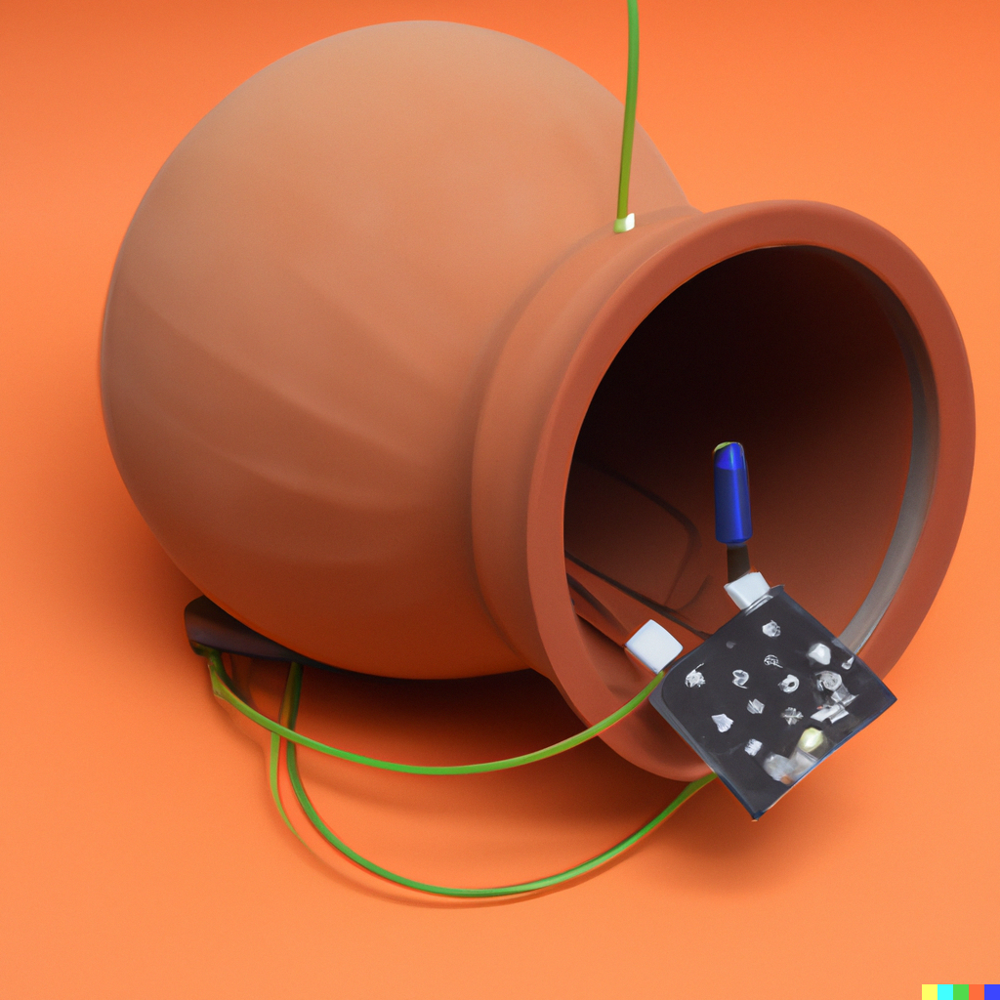

## expanded material imaginaries

Initial research for the a possible future project.

---

## previous steps

*(sorry for those who are seeing this again for the hundreth time)*

---

## previous steps

### Vozes da Terra

Project developed with [André Anastácio](https://4n4st4cio.wordpress.com/) together with Pankararu community in north-east Brazil.

	

		
	

	

		
		
	

---

## previous steps

### Arche-Scriptures

Project started in the class *New Material Imaginaries* using ceramics as a speculative medium for information storage.

	

		
	

---

## next step

- continue working with ceramics.
- go beyond ceramics as a material and start to think of its historical use as *pots*.
- think of itinerant *artifacts*, which can be independent from an exhibition space.
- something *in network*.
- something that deals with memory, storage, maybe sound. 

---

## research

Understanding *ceramics pots* as an (almost) universal archaic storage "device".

---

## research

### mapping ceramic potery production. [link](https://www.google.com/maps/d/edit?mid=1wJKlUTLOY2Zz81MByJTXeFkdTmjdAY6f&usp=sharing)

	

		
	

---

## research

### the aquarius / wassermann

	

		

			
		

	

---

## research

### the aquarius / wassermann

	

		

			
		

	

---

## research

### pots and the "great flood"

Great flood - digital age? idk...

	

		

			
			<small>Ancient Egypt - Dendera zodiac</small>
		

		

			
			<small>Depiction of Sumerian god Enki</small>
		

		

			
			<small>Seal of Adda</small>
		

	

---

## references

	<iframe class="center" width="637" height="360" src="https://www.youtube.com/embed/mDyo8CoP7v0" title="Chelpa Ferro: Acusma" frameborder="0" allow="accelerometer; autoplay; clipboard-write; encrypted-media; gyroscope; picture-in-picture; web-share" allowfullscreen></iframe>

---

## references

	<iframe class="center" width="637" height="360" src="https://www.youtube.com/embed/xWJ-K2wzmAc" title="Chelpa Ferro: Microfônico Vasos" frameborder="0" allow="accelerometer; autoplay; clipboard-write; encrypted-media; gyroscope; picture-in-picture; web-share" allowfullscreen></iframe>

---

## idea

a set of devices that:

- enclosed by a ceramic object;
- autonomously collect information of the enveiroment around them (sound, temperature, humidity... not sure yet);
- connect to each other through a network system;
- communicate to each other when they are close;
- have battery to run hours without power plug;
- are solar powered (perhaps);
 
 > *(the social aspect of such objects, how exactly they can interact with the enveiroment around them is somehting I was to stay open-ended for now)*

--- 

## idea

	

		

			
		

	

---

## technology

- prototype using the new clay 3d printer at hfk?
- network system using _ESP32_ (?)
- solar powered (?)
- sensors (?)
- microphone (?)
- speakers (?)

	

		

			

			
		

		

	

--- 

## some dall-e prototypes

	

		

		

		

		

		

		

	

---

### thank you!

