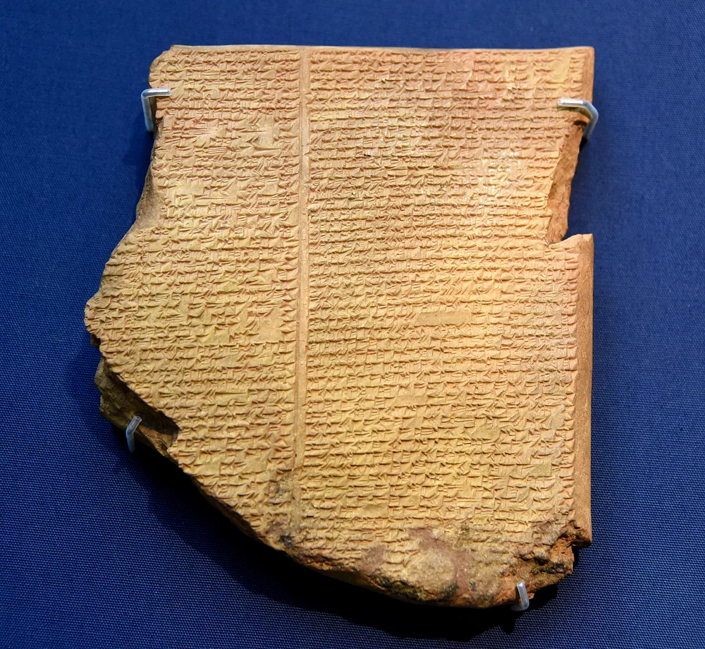

# Expanded Material Imaginaries

Initial research for the possible future project.

1. vozes da terra
1. arche-scriptures
1. research
1. symbology of the wassermann through cultures
1. the great flood
1. potery preserving 'device' 

---

## gilgamesh 

---

thank you!